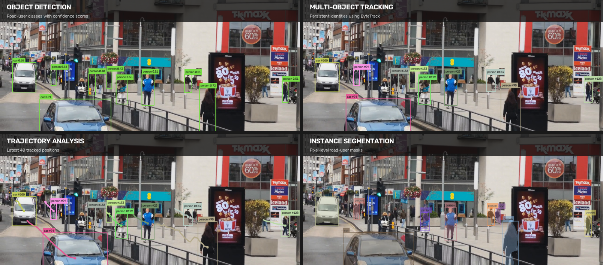
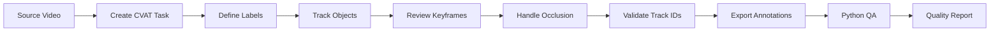
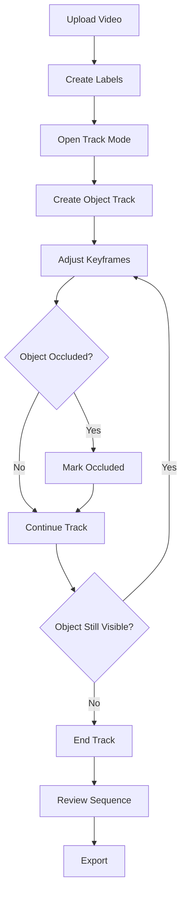

<div align="center">

# Video Object Tracking & Annotation

### Computer Vision Annotation · CVAT · Track Continuity · Occlusion Handling · Dataset QA



A practical computer vision annotation project demonstrating **video object tracking, bounding-box annotation, track continuity, occlusion handling, class labeling, structured exports, and annotation quality assurance** using CVAT and Python.

</div>

---

## Overview

Video annotation is more than drawing boxes on individual frames. High-quality tracking requires each object to retain a consistent identity as it moves through time, becomes partially hidden, leaves the scene, or reappears.

This project documents a complete annotation workflow for producing and validating **frame-to-frame object tracks** suitable for computer vision datasets.

It focuses on the parts of video annotation that directly affect dataset quality:

- consistent track IDs
- accurate bounding boxes
- correct class labels
- occlusion handling
- track continuity
- objects entering and leaving the frame
- annotation review and correction
- structured CVAT exports
- automated QA with Python

---

## What This Project Demonstrates

| Area | Practical evidence |
|---|---|
| **Video Object Tracking** | Persistent object identities across sequential frames |
| **Bounding Boxes** | Accurate object localization throughout motion |
| **CVAT** | Track-mode annotation and structured annotation export |
| **Occlusion Handling** | Maintaining object identity through partial visibility |
| **Track Continuity** | Detecting broken, duplicated, or inconsistent tracks |
| **Class Management** | Consistent labels across the annotation sequence |
| **Annotation QA** | Manual review plus programmatic validation |
| **Python** | Parsing, validating, visualizing, and summarizing annotations |

---

## Annotation Workflow



---

## Tracking Principles

### Persistent Track Identity

The same real-world object keeps the same track ID throughout its visible lifetime.

```text
Frame 001        Frame 045        Frame 103
Car #12   ─────> Car #12   ─────> Car #12
```

A moving object should not receive a new identity simply because its position changes.

### Occlusion

When an object becomes partially hidden, its track should remain continuous when the object can still be reliably associated with the same instance.

```text
Visible → Partially Occluded → Visible Again
  #07             #07                #07
```

### Entry and Exit

Tracks begin when an object becomes annotatable and end when it permanently leaves the sequence or no longer satisfies the annotation criteria.

---

## Example Label Set

A traffic-oriented sample sequence can use:

| Label | Example |
|---|---|
| `car` | Passenger vehicles |
| `truck` | Commercial trucks |
| `bus` | Public or private buses |
| `motorcycle` | Motorcycles and scooters |
| `person` | Pedestrians |
| `bicycle` | Bicycles |

The final label set should always follow the dataset's annotation specification.

---

## CVAT Annotation Pipeline



---

## Annotation Quality Checks

The QA stage verifies that annotations are internally consistent before they are treated as finished dataset assets.

Checks include:

- invalid bounding-box coordinates
- boxes outside image boundaries
- duplicate track IDs
- missing labels
- unexpected class names
- zero-area or extremely small boxes
- broken track continuity
- suspicious frame gaps
- duplicate annotations
- malformed exports

---

## Planned Python Validation

```text
Annotation Export
      │
      ▼
Parse CVAT XML / JSON
      │
      ├── Validate coordinates
      ├── Validate labels
      ├── Check track IDs
      ├── Inspect frame gaps
      ├── Detect duplicates
      └── Calculate statistics
      │
      ▼
Annotation Quality Report
```

---

## Dataset Statistics

The validation layer will generate useful dataset-level summaries such as:

```text
Frames reviewed:          1,240
Object tracks:              186
Bounding boxes:           8,742
Tracked classes:              6
Occluded instances:         421
Potential QA issues:          9
```

Values shown here illustrate the planned report format. Repository datasets will contain their own measured results.

---

## Repository Structure

```text
video-object-tracking-annotation/
│
├── README.md
├── LICENSE
├── requirements.txt
│
├── annotations/
│   ├── tracks.xml
│   └── tracks.json
│
├── data/
│   └── README.md
│
├── samples/
│   ├── frame_001.jpg
│   ├── frame_050.jpg
│   └── frame_100.jpg
│
├── src/
│   ├── validate_tracks.py
│   ├── visualize_tracks.py
│   ├── track_statistics.py
│   └── convert_annotations.py
│
├── reports/
│   └── annotation_quality_report.md
│
├── docs/
│   ├── assets/
│   │   └── video-tracking-hero.png
│   ├── annotation-guidelines.md
│   └── quality-control.md
│
└── tests/
```

---

## Quality Assurance Strategy

### 1. Visual Review

Inspect representative frames and difficult transitions manually.

### 2. Track Consistency

Confirm that object identities remain stable across the sequence.

### 3. Boundary Validation

Ensure all boxes remain within frame boundaries and have valid dimensions.

### 4. Label Validation

Check all annotations against the approved class list.

### 5. Automated Checks

Run Python validation against exported annotations to flag suspicious records for review.

---

## Tools & Technologies

`CVAT` · `Python` · `Computer Vision` · `Video Annotation` · `Object Tracking` · `Bounding Boxes` · `XML` · `JSON` · `Dataset QA`

---

## Development Roadmap

- [ ] Select an openly licensed or self-recorded video sequence
- [ ] Create CVAT annotation task
- [ ] Define annotation specification
- [ ] Annotate object tracks
- [ ] Export CVAT annotations
- [ ] Add representative annotated frames
- [ ] Build annotation parser
- [ ] Validate bounding boxes
- [ ] Validate track continuity
- [ ] Generate dataset statistics
- [ ] Produce QA report
- [ ] Add automated tests

---

## Repository Goals

This project provides practical evidence of work across:

**Computer Vision Annotation**

**Video Object Tracking**

**CVAT**

**Bounding-Box Annotation**

**Track Continuity**

**Occlusion Handling**

**Annotation Quality Assurance**

**Python Data Validation**

---

## License

Released under the **MIT License**. Any sample media included in the repository will use compatible licensing or original material.

---

<div align="center">

**Computer Vision Annotation · Video Object Tracking · Dataset Quality**

</div>
